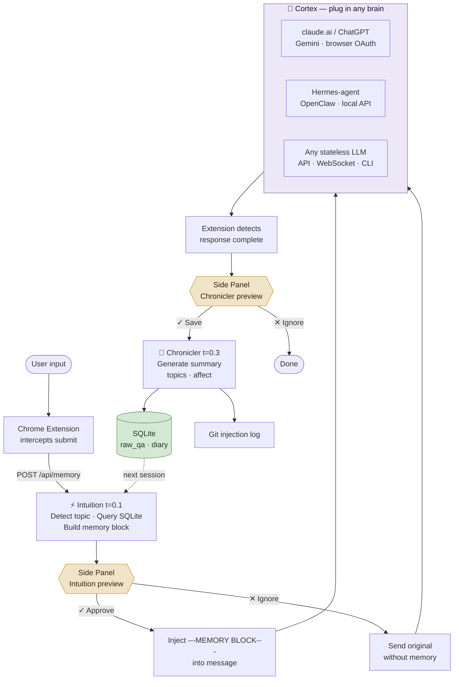

# Pneuma Memory

**Stateless-API memory layer for AI chat providers.**  
Works with claude.ai, ChatGPT, Gemini — no API key required.  
Apache 2.0

---

## The Problem

Stateless LLM APIs re-read the full conversation history on every request.

```
Turn 1:  send  1K tokens  → pay for  1K
Turn 2:  send  3K tokens  → pay for  3K  (1K is re-read)
Turn 3:  send  6K tokens  → pay for  6K  (4K is re-read)
...
Turn 30: send 90K tokens  → pay for 90K  (81K is re-read)

TOTAL: ~1.3M tokens billed. Actual new content: ~9K tokens.
```

Beyond cost: knowledge from last week's conversation is gone. Every new chat starts from zero.

**Pneuma breaks both problems** — injects only *relevant historical context* per message, persists knowledge across sessions, providers, and model versions.

---

## How It Works



---

## Current State (MVP — working)

| Feature | Status |
|---------|--------|
| Chrome extension (claude.ai) | ✅ |
| Side panel: Intuicja + Kronikarz preview | ✅ |
| SQLite memory store | ✅ |
| LM Studio integration (Gemma 4, Qwen) | ✅ |
| Topic-based retrieval | ✅ |
| Git injection log | ✅ |
| Built-in chat UI (web) | ✅ |
| Import from Markdown exports | ✅ |
| WireGuard / SSL remote access | ✅ |
| ChatGPT / Gemini selectors | ⚠️ untested |
| Per-session deduplication | 🔲 planned |
| Embedding-based retrieval | 🔲 planned |

---

## Real Numbers (30-turn session)

| Approach | Tokens sent | Cost @ $3/MTok |
|----------|-------------|----------------|
| Full history replay | ~135,000 | ~$0.40 |
| Pneuma (memory block ~850 tok constant) | ~34,500 | ~$0.10 |
| **Savings** | **74%** | **~$0.30** |

Plus: memory block pulls from *any* prior session. Full history replay is limited to the current context window.

---

## Quick Start

See [QUICKSTART.md](QUICKSTART.md).

**Requirements:** Node.js 18+, LM Studio with `google/gemma-4-4b-it` (8GB RAM), Chrome

```bash
git clone https://github.com/your-org/pneuma-memory.git
cd pneuma-memory
npm install && cp .env.example .env
node server.js          # Windows: start.bat
```

Load `extension/` as unpacked Chrome extension → click **P** icon → side panel opens.

---

## Architecture

Three roles, one model in VRAM, three temperatures:

| Role | Temp | Job |
|------|------|-----|
| **Intuicja** | 0.1 | Topic detection + memory retrieval |
| **Kronikarz** | 0.3 | Async diary generation |
| **Kinia** | 0.7 | Main responder (local or Claude API) |

Default model: `google/gemma-4-4b-it` — runs on 8GB RAM.

Full data flow: [docs/ARCHITECTURE.md](docs/ARCHITECTURE.md)

---

## Roadmap

MVP uses SQLite + keyword routing. Planned:

- [ ] Per-session deduplication — skip already-injected atoms within a session
- [ ] Embedding-based retrieval — replace keyword matching
- [ ] Atom model — structured fact units with `atom_id`, tags, `used_in_sessions[]`
- [ ] Graph memory (Neo4j) — relationships between atoms
- [ ] Obsidian integration — vault notes as memory atoms
- [ ] ChatGPT / Gemini extension validation
- [ ] Multi-LLM routing

See [PAPER.md](PAPER.md) and [docs/DEDUPLICATION.md](docs/DEDUPLICATION.md).

---

## Docker

```bash
docker-compose up -d
```

LM Studio runs on host — set `LMSTUDIO_URL=http://host.docker.internal:1234` in `.env`.

---

## Docs

| File | Content |
|------|---------|
| [QUICKSTART.md](QUICKSTART.md) | 5-minute setup |
| [PAPER.md](PAPER.md) | Problem, architecture, design decisions |
| [docs/ARCHITECTURE.md](docs/ARCHITECTURE.md) | Full data flow, components |
| [docs/DEDUPLICATION.md](docs/DEDUPLICATION.md) | Dedup algorithm (current + planned) |
| [docs/TOKEN_ECONOMICS.md](docs/TOKEN_ECONOMICS.md) | Cost model, benchmarks |
| [docs/CONSCIOUSNESS.md](docs/CONSCIOUSNESS.md) | Why this is substrate-independent memory |

---

## vs. SuperAssistant / RAG

| | SuperAssistant | RAG | Pneuma |
|--|----------------|-----|--------|
| **Purpose** | MCP tool execution | Document retrieval | Personal memory |
| **API key** | Optional | Required | Not required |
| **State** | Stateless | Stateless | Stateful per session |
| **Memory** | None | "All docs equal" | Facts with session state |

---

## Contributing

Apache 2.0 — fork freely. Useful contributions:

- Per-session deduplication implementation
- ChatGPT/Gemini selector validation
- Embedding-based topic classification
- Production deployment guide

---

*Built by someone tired of paying for re-read tokens.*
