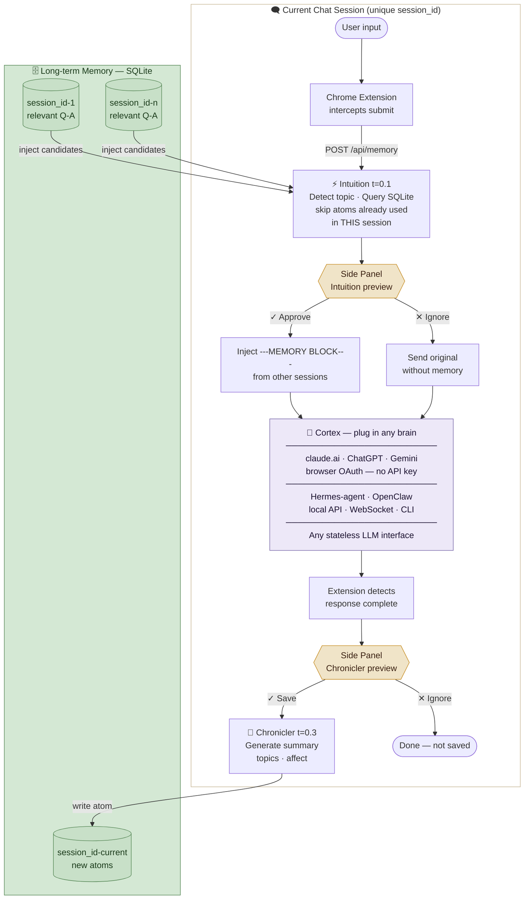

# Pneuma Memory — Architecture

## Full Flow Diagram



## Overview

Pneuma is a local memory layer that sits between you and any AI chat provider. It intercepts your messages, enriches them with relevant historical context, and saves the AI's responses for future use — all under your manual control.

```
Browser (claude.ai / chatgpt.com / gemini.google.com)
    │
    │  Chrome Extension (DOM interception)
    │
    ▼
Local Express Server (port 3333)
    │
    ├── /api/memory    → Intuicja: build memory block
    ├── /api/chronicle → Kronikarz: save Q-A to DB
    ├── /api/status    → health check
    └── /import        → bulk import UI
    │
    ├── SQLite (sql.js, pure WASM)
    │     raw_qa       — raw question/answer pairs
    │     diary        — LLM-generated summaries
    │     memory_log   — injection audit log
    │
    ├── LM Studio (localhost:1234, OpenAI-compatible)
    │     Intuicja  t=0.1 — topic routing
    │     Kronikarz t=0.3 — diary generation
    │     Kinia     t=0.7 — main responder (optional)
    │
    └── Git (memory-git/) — immutable injection log
```

---

## Data Flow: Single Turn

### T=0: User types message

User types in claude.ai input box. Chrome extension content script is listening on capture phase for Enter/submit button.

### T=1: Submit intercepted

Content script intercepts the submit event (`preventDefault`). Original message stored as `lastQuestion`.

### T=2: Memory block fetch

```
POST localhost:3333/api/memory
{
  "message": "user's question",
  "sessionId": "ext_abc123"
}
```

Server runs `buildMemoryBlock()`:
1. `detectTopic(message)` — keyword matching → topic label
2. `getLastQA(sessionId, 3)` — last 3 Q-A pairs from this session
3. `getQAByTopic(topic, 5)` — top 5 historically relevant Q-A
4. `getDiaryByTopic(topic, 2)` — 2 diary entries on this topic
5. Assembles markdown block

### T=3: Side panel preview

Extension sends `intuicja_preview` message to background service worker → relayed to side panel.

Side panel displays:
- Topic pill (e.g. `# lmstudio`)
- Memory block text (scrollable)
- **Zatwierdź** / **Ignoruj** buttons

User has ~30s to decide. Auto-approve on timeout.

### T=4: Message injection (if approved)

If user approves, content script clears the input and re-inserts:
```
[original question]

---MEMORY BLOCK---
[relevant historical Q-A]
---END MEMORY---
```

Using `document.execCommand('insertText')` for ProseMirror compatibility.

### T=5: Submit

Content script clicks the submit button. Message with injected memory sent to AI provider (claude.ai, ChatGPT, etc.) using the user's existing browser session. No API key needed.

### T=6: Response detection

Content script watches for `data-testid="action-bar-retry"` to appear in DOM. This element is added by claude.ai when a response is complete (retry = regenerate — only exists on assistant messages).

### T=7: Kronikarz preview

Extension sends `kronikarz_preview` to side panel:
- Q: truncated question
- A: truncated answer

User decides: **Zapisz** / **Ignoruj**.

### T=8: Save (if approved)

Side panel calls:
```
POST localhost:3333/api/chronicle
{
  "question": "...",
  "answer": "...",
  "sessionId": "ext_abc123"
}
```

Server:
1. Saves raw Q-A to `raw_qa` table
2. Calls LM Studio (Kronikarz, t=0.3) to generate:
   ```json
   { "summary": "...", "topics": ["topic1"], "affect": "focused" }
   ```
3. Saves diary entry to `diary` table
4. Git commits injection log

---

## Components

### Chrome Extension (`extension/`)

**content.js** — DOM interceptor  
Runs on `document_idle` in claude.ai/ChatGPT/Gemini. Capture-phase listeners intercept Enter key and submit button clicks. Async `handleSend()` orchestrates the full flow.

**sidepanel.js/html** — decision UI  
Side panel (MV3 `chrome.sidePanel`). Opens on extension icon click. Receives previews from background, sends decisions back.

**background.js** — message relay  
Service worker. Relays messages between content script tabs and the side panel. Also opens side panel on action click.

### Express Server (`server.js`)

Single-file Express + WebSocket server. REST endpoints for the extension, WebSocket for the built-in chat UI. Initializes DB on startup, serves static renderer.

### SQLite Layer (`src/db/db.js`)

Uses `sql.js` (pure WASM) — no native build step required. Loads `pneuma.db` from disk on startup, persists after every write. No connection pooling — single-process, synchronous access after async init.

**Tables:**
- `raw_qa` — `(id, session_id, question, answer, topic, created_at)`
- `diary` — `(id, session_id, summary, essay, topics, affect, source_qa_id, created_at)`
- `memory_log` — `(id, session_id, topic, qa_count, diary_count, injected_at)`

### Intuicja (`src/pneuma/intuicja.js`)

Topic map: 10 topics × keyword arrays. `detectTopic()` counts keyword matches, returns `{topic, confidence, keywords}`. `buildMemoryBlock()` queries DB and assembles the injection string.

Topic list: `pneuma, llm, n8n, electron, baza, agent, filozofia, kod, mcp, lmstudio`

### Kronikarz (`src/pneuma/kronikarz.js`)

Async — never blocks the user. LM Studio call with JSON prompt. Falls back to extracting first 200 chars if LLM fails. Always saves raw Q-A regardless of summary generation success.

### LM Studio Client (`src/api/lmstudio.js`)

Plain `http.request` — no axios, no API key. OpenAI-compatible `/v1/chat/completions`. Temperature map per role. Single model in VRAM, temperature is the only difference.

---

## Extension ↔ Server Communication

```
Content Script  ──fetch──►  Express Server
                ◄──JSON──

Content Script  ──chrome.runtime.sendMessage──►  Background SW
Background SW   ──chrome.runtime.sendMessage──►  Side Panel
Side Panel      ──chrome.runtime.sendMessage──►  Background SW
Background SW   ──chrome.tabs.sendMessage──►     Content Script
```

CORS headers: `Access-Control-Allow-Origin: *` on all Express routes.

---

## Security Model

- Server binds to `0.0.0.0` — accessible on local network
- No authentication — designed for personal use on trusted network
- For remote access: WireGuard tunnel + nginx reverse proxy with SSL
- Extension permissions: `sidePanel, tabs, scripting, storage` + host permissions for localhost:3333 and target chat sites
