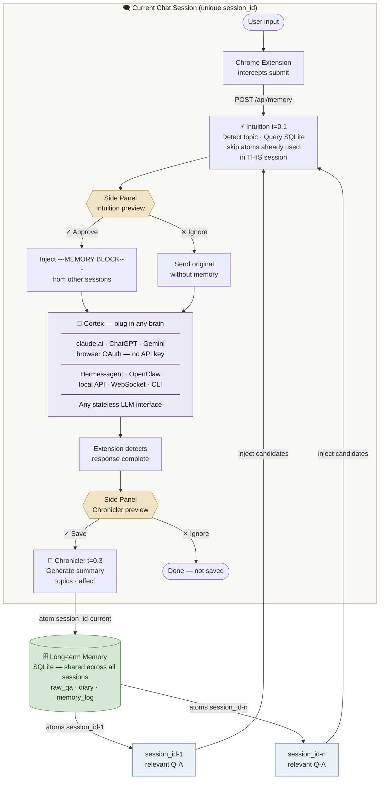

```mermaid
flowchart TD

    subgraph SESSION["🗨️ Current Chat Session  (unique session_id)"]
        direction TD
        U([User input]) --> EXT["Chrome Extension\nintercepts submit"]
        EXT -->|POST /api/memory| INT

        INT["⚡ Intuition  t=0.1\nDetect topic · Query SQLite\nskip atoms already used\nin THIS session"]
        INT --> SP1

        SP1{{"Side Panel\nIntuition preview"}}
        SP1 -->|✓ Approve| INJ["Inject ---MEMORY BLOCK---\nfrom other sessions"]
        SP1 -->|✕ Ignore| ORIG["Send original\nwithout memory"]

        INJ --> CORTEX
        ORIG --> CORTEX

        CORTEX["🧠 Cortex — plug in any brain\n─────────────────────────\nclaude.ai · ChatGPT · Gemini\nbrowser OAuth — no API key\n─────────────────────────\nHermes-agent · OpenClaw\nlocal API · WebSocket · CLI\n─────────────────────────\nAny stateless LLM interface"]

        CORTEX --> DET["Extension detects\nresponse complete"]
        DET --> SP2

        SP2{{"Side Panel\nChronicler preview"}}
        SP2 -->|✓ Save| CHR["📖 Chronicler  t=0.3\nGenerate summary\ntopics · affect"]
        SP2 -->|✕ Ignore| DONE([Done — not saved])
    end

    DB[("🗄️ Long-term Memory\nSQLite — shared across all sessions\nraw_qa · diary · memory_log")]

    CHR -->|atom session_id-current| DB

    DB -->|atoms session_id-1| S1["session_id-1\nrelevant Q-A"]
    DB -->|atoms session_id-n| SN["session_id-n\nrelevant Q-A"]

    S1 -->|inject candidates| INT
    SN -->|inject candidates| INT

    style SP1 fill:#f0e4c8,stroke:#c8902a,color:#3a2010
    style SP2 fill:#f0e4c8,stroke:#c8902a,color:#3a2010
    style CORTEX fill:#ede8f8,stroke:#7a6aaa,color:#1a1030
    style DB fill:#d4e8d4,stroke:#5a8a5a,color:#1a3a1a
    style SESSION fill:#faf8f4,stroke:#c8b898,color:#2c2118
    style S1 fill:#e8f0f8,stroke:#6a8aaa,color:#1a2a3a
    style SN fill:#e8f0f8,stroke:#6a8aaa,color:#1a2a3a
```
